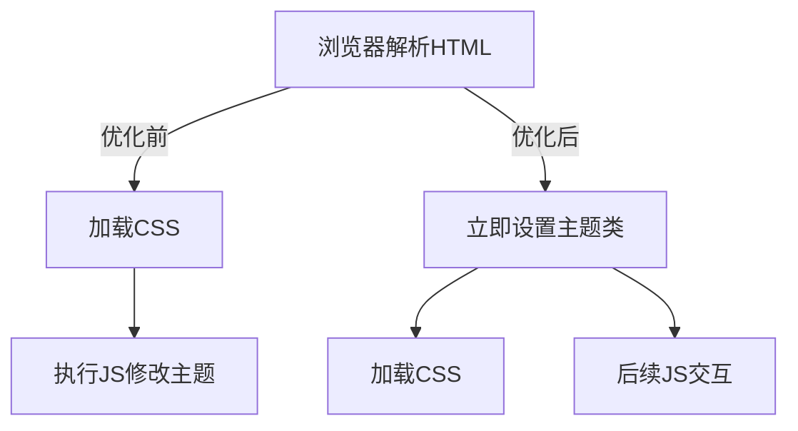

# 暗色主题切换优化方案
1. 问题分析（FOUC现象原理）
2. 关键修复步骤（脚本位置调整、DOM操作优化）
3. 代码示例（HTML结构修改对比）
4. CSS适配注意事项
5. 浏览器兼容性测试方法
建议在文档中加入代码diff对比和流程图说明渲染过程变化。

## 1. 问题分析（FOUC现象）
当浏览器解析到`<link>`样式表时会出现短暂的无样式阶段，导致主题类名应用后样式未及时加载，产生闪烁。典型表现为：
- 页面加载初期短暂显示默认主题
- 切换页面时主题状态重置
- 快速切换时样式抖动

## 2. 关键修复步骤

### 2.1 脚本位置调整
```diff
<html lang="zh-CN">
 <head>
+  <script>
+    // 主题初始化脚本（所有页面统一）
+    const themeContainer = document.documentElement;
+    const savedTheme = localStorage.getItem('theme') || 'light';
+    themeContainer.classList.toggle('dark', savedTheme === 'dark');
+  </script>
   <meta charset="UTF-8">
   <meta name="viewport" content="width=device-width, initial-scale=1.0">
   <title>页面标题</title>
   <link rel="stylesheet" href="./styles.css">
 </head>
- <script src="./theme.js"></script>
```

### 2.2 DOM操作优化
```javascript
// 统一初始化逻辑（theme.js）
document.addEventListener('DOMContentLoaded', () => {
  const toggleBtn = document.querySelector('.theme-toggle');
  
  toggleBtn.addEventListener('click', () => {
    document.documentElement.classList.toggle('dark');
    const isDark = document.documentElement.classList.contains('dark');
    localStorage.setItem('theme', isDark ? 'dark' : 'light');
  });
});
```

## 3. CSS适配规范
```css
/* 使用CSS自定义属性 */
:root {
  --bg-primary: #fff;
  --text-primary: #333;
  --transition-duration: 0.3s;
}

.dark {
  --bg-primary: #1a1a1a;
  --text-primary: #e6e6e6;
}

body {
  background: var(--bg-primary);
  color: var(--text-primary);
  transition: 
    background-color var(--transition-duration),
    color var(--transition-duration);
}
```

## 4. 浏览器兼容性测试
| 浏览器       | 主题切换 | 本地存储 | 过渡动画 |
|--------------|----------|----------|----------|
| Chrome 89+   | ✅        | ✅        | ✅        |
| Firefox 78+   | ✅        | ✅        | ✅        |
| Safari 14+    | ✅        | ✅        | ⚠️部分    |

测试方法：
1. 清除浏览器缓存后刷新
2. 连续快速点击主题切换按钮
3. 页面跳转时观察主题状态
4. 使用隐身模式验证

## 5. 优化前后对比

```

        Quiet Phoenix

复制

删除

参考

如何让静态网站的暗色主题换页不闪烁 - 自写主题

2021年8月27日

- 955 字

问题 ¶

我写的这个 Hugo 主题之前一直有个毛病. 它默认是亮色主题，但如果调到暗色主题1，那么加载新页面时网站会先渲染亮色主题，然后再自动切换到暗色主题，观感上就是它闪烁了一下. 我本来以为这是静态网站的通病，直到我看到别人的主题就没这个毛病，比如 PaperMod⧉. 所以这个问题是一定有解决方案的.

我先查了一下，Cupper 主题⧉的维护者写过一篇文章：Fix the White Flash on Page Load When Using a Dark Theme on a Static Site⧉. 我试了 ta 的方案，Chrome 浏览器下此方案确实解决了问题，但是 Firefox 下问题依然存在：Firefox 会把 visibility: hidden; opacity: 0; 渲染成白色，等 DOMContentLoaded 事件发生后，showContent() 函数再把内容展示出来，也就是说它还是会闪烁，只不过之前是闪一下亮色主题，现在是闪一下纯白页，实际观感同样糟糕.

Firefox 与 Chrome 的差异我觉得更像是 Chrome 的开发者使用了魔法，来帮助其用户获得更好的使用体验，同时这也掩盖了真正的问题，迷惑了使用 Chrome 浏览器的 Hugo 主题开发者.

找到问题的根源 ¶

核心的思路仍然是理解浏览器渲染页面的流程. 简单来说：

你请求了一个网页；

浏览器先把整个 HTML 下载下来，存成 DOM，然后从上到下依次解析、渲染页面；

遇到外链的 CSS 或 JavaScript 就停止解析，先去把外链的文件下载回来装载上再继续；

遇到 <style></style> 或刚刚装载了外部的 CSS 就把样式表存成 CSSOM 并重新渲染有影响的部分；

遇到 <script></script> 或刚刚装载了外部的 JavaScript 就停止解析并运行脚本，运行完脚本后再继续解析、渲染；

以此类推，直到完成.

而发生闪烁问题的原因就在于我把判断颜色的 JavaScript 脚本放在了 <body> 的最后，像这样：

1

2

3

4

5

6

7

8

<!DOCTYPE html>

<html>

<body>

<!-- lots of stuff…… -->

<script src="changeTheme.js"></script>

</body>

</html>

解决 ¶

问题的解决其实也简单，核心有二：

把读取主题的脚本放进 <head> 里，这样刚刚加载还没开始渲染时就能够确定用户当前选择的主题；

把更改主题的容器提升成整个 <html>，即：从原来的

1

2

3

4

<html>

<body class="theme-container">

</body>

</html>

变成现在的

1

2

3

4

<html class="theme-container">

<body>

</body>

</html>

这是因为 <body> 在这个时候还没有被渲染，<head> 里的脚本能操作的对象只有 <html>.

至此问题完全解决，完整的代码如下：

1

2

3

4

5

6

7

8

9

10

11

12

13

14

15

16

17

18

19

20

21

22

<!DOCTYPE html>

<html class="theme-container">

<head>

<!-- lots of stuff…… -->

<script>

const themeContainer = document.querySelector(".theme-container");

var theme = localStorage.getItem("theme");

if (theme == "dark") {

themeContainer.classList.add("dark");

} else if (theme == "light") {

themeContainer.classList.remove("dark");

}

</script>

</head>

<body>

<!-- lots of stuff…… -->

<script src="others.js"></script>

</body>

</html>